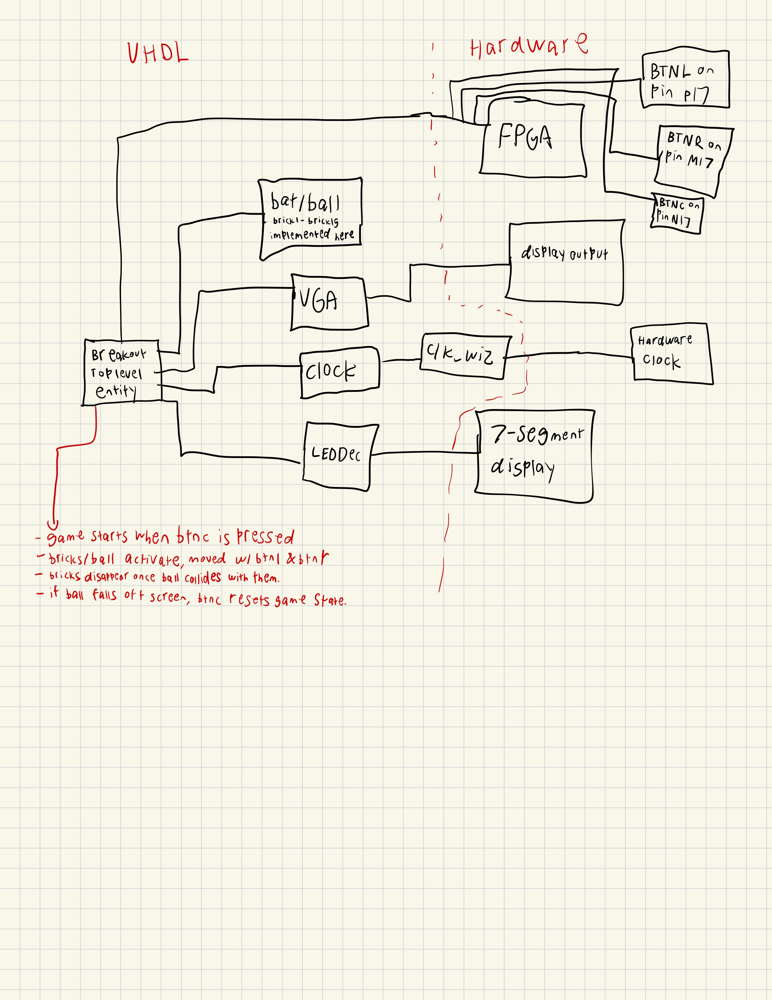

# CPE 487 2024S: Final Project
## Kevin Ulis & Arminder Singh
### Breakout Game

## Introduction/Design concept/foundation

For our CPE 487 project, we decided to modify the base Lab 6 code to recreate the game 'Breakout', where the objective is to break all of the bricks at the top of the screen. (Display prints out "E487") When the game ends, pressing a button on the board will reset the game if either all bricks are broken (Display prints out "G00D") or the ball hits the bottom wall (Display prints out "L0SE").\
\
A cyan-colored bat is drawn at the bottom of the screen, which is user-controlled by buttons on the board. The user should hold button `BTNL` to move the bat to the left, and should hold button `BTNR` to move the bat to the right. To start or reset the game, the user must press the button `BTNC`, which will reset all of the bricks and the ball's position on the screen. As the ball constantly moves across the screen with independent X and Y motion vectors, the bat must be moved in order to bouce the ball back up into the bricks to win. If the ball is not hit by the bat, it will disappear from the bottom of the screen, and the user must reset the game.

## [Demo video](https://youtu.be/KR1i7qVgJVU)

## Attachments needed

- VGA-capable monitor, or a VGA-to-HDMI converter to see video output
- Nexys A7-100T board, the bat and game state is controlled by the buttons on the board, and game status is on the display.

## Block Diagram

#
## Modifications done to Lab 6 base code
This project was originally built from the alternative Lab 6 source code, which used the board buttons to move the bat across the screen. The "adc_if.vhd" file is not used in this project, as the external potentiometer is not used and no analog to digital conversion is needed.
\
\
Modifications were only made to the files "pong.vhd," "bat_n_ball.vhd," "leddec16.vhd," and the constraints file "pong.xdc." A new file named "brick.vhd" was created to initialize a brick object, but this was an experimental file which was created early in the development process, and it now has no behavioral architecture. As a future improvement, it is more efficient to do all of the collision detection and drawing within the "brick.vhd" file and create 15 different instances of `brick`. However, many signals must be passed into "brick.vhd" that deal with VGA colors, the VGA sync pulse, and the ball coordinates in order to do all calculations.

## "pong.xdc" Modifications
In the constrains file, a new constraint linked to SW0 at port `J15` is assigned to signal `speed` in the pong.vhd file. This switch determines the rate at which the bat moves across the screen. At the rising edge of the system clock and with the switch in the upward position, the bat moves 15 pixels across the screen, depending if the left button or the right button is pressed. When the switch is in the downward position, the bat only moves 10 pixels across the screen each system clock.\
```set_property -dict {PACKAGE_PIN J15 IOSTANDARD LVCMOS33} [get_ports {speed}]```

## "pong.vhd" Modifications
A signal was added to the "pong" entity named "speed," which is an input signal linked to the constraints file as mentioned above. The signal is created as an input, as it will be controlled externally by the switch SW0 at port `J15`.\
```speed : IN STD_LOGIC```
### "pong.vhd" Behavioral Architecture Modifications
In the Behavioral Architecture, no additional signals were needed as the `speed` signal will be directly used by the process `pos`. When declaring the `bat_n_ball` component in the behavioral architecture, a new 16-bit output signal `disp_data` must be declared, which is a signal that controls what is displayed on the seven-segment displays. This signal will only be changed by the "bat_n_ball.vhd" file, but it must be referenced in "pong.vhd" as it must be passed through into "leddec16.vhd" in order to display it.
```vhdl
COMPONENT bat_n_ball IS
      PORT (
            v_sync : IN STD_LOGIC;
            pixel_row : IN STD_LOGIC_VECTOR(10 DOWNTO 0);
            pixel_col : IN STD_LOGIC_VECTOR(10 DOWNTO 0);
            bat_x : IN STD_LOGIC_VECTOR (10 DOWNTO 0);
            serve : IN STD_LOGIC;
            red : OUT STD_LOGIC;
            green : OUT STD_LOGIC;
            blue : OUT STD_LOGIC;
            disp_data : OUT STD_LOGIC_VECTOR(15 DOWNTO 0) -- Added
      );
```

In the `pos` process within the behavioral architecture, changes were made to check the value of `speed` when moving the bat across the screen. At the rising edge of `clk_in`, another IF statement is used after the program recognizes a button press that moves the bat. Once the button has been detected as pressed, it checks the value of `speed`. If the switch is in the "up" position, it will either subtract 15 from the bat's current position if the `BTNL` button is pressed, or it will subtract 10 from the bat's current position if switch is in the "down" position. It is the same functionality if the `BTNR` button is pressed, but it instead adds 15 or 10 to the bat's current position depending on the state of the switch. 

```vhdl
pos : PROCESS (clk_in) is
    BEGIN
        if rising_edge(clk_in) then
            count <= count + 1;
            IF (btnl = '1' and count = 0 and batpos > 0) THEN
                -- Begin Added Code
                IF (speed = '1') THEN
                    batpos <= batpos - 15;
                ELSE
                    batpos <= batpos - 10;
                END IF;
                -- End Added Code
            ELSIF (btnr = '1' and count = 0 and batpos < 800) THEN
                -- Begin Added Code
                IF (speed = '1') THEN
                    batpos <= batpos + 15;
                ELSE
                    batpos <= batpos + 10;
                 -- End Added Code
                END IF;
            END IF;
        end if;
    END PROCESS;
```

When initializing the port map for `add_bb` as a type `bat_n_ball`, the new signal declared `disp_data` in the Component for `bat_n_ball` must be linked to the 16-bit signal `display` which was created in the behavioral architecture. Changes are only made to `disp_data` within "bat_n_ball.vhd," but these signals must be linked in order to get the signal over to "leddec16.vhd," where it can then be displayed on the seven-segment display. 
```vhdl
add_bb : bat_n_ball
    PORT MAP(--instantiate bat and ball component
        v_sync => S_vsync, 
        pixel_row => S_pixel_row, 
        pixel_col => S_pixel_col, 
        bat_x => batpos, 
        serve => btn0, 
        red => S_red, 
        green => S_green, 
        blue => S_blue,
        disp_data => display -- Added
    );
```

## "bat_n_ball.vhd" Modifications
In the `bat_n_ball` entity declaration, a new 16-bit signal `disp_data` is added, which is used to change what is displayed on the seven-segment display. This signal is changed only when checking which state the game is currently in. 
```vhdl
ENTITY bat_n_ball IS
    PORT (
        v_sync : IN STD_LOGIC;
        pixel_row : IN STD_LOGIC_VECTOR(10 DOWNTO 0);
        pixel_col : IN STD_LOGIC_VECTOR(10 DOWNTO 0);
        bat_x : IN STD_LOGIC_VECTOR (10 DOWNTO 0); -- current bat x position
        serve : IN STD_LOGIC; -- initiates serve
        red : OUT STD_LOGIC;
        green : OUT STD_LOGIC;
        blue : OUT STD_LOGIC;
        disp_data : OUT STD_LOGIC_VECTOR(15 DOWNTO 0) -- Added
    );
END bat_n_ball;
```
### "bat_n_ball.vhd" Behavioral Architecture Modifications
The constant `bat_w`, which describes the bat width in pixels, was changed from 20 to 40 in order to make the game easier for the player, since the bat can be difficult to control when using the board buttons.
```vhdl
CONSTANT bat_w : INTEGER := 40; -- bat width in pixels
```

### Brick initializations
In order to create a brick on the screen, new signals must be created to describe where the brick should be drawn, the brick dimensions (height, width) the initial X and Y coordinates of the brick, and the present state of the brick. The signal `brick_on` is set when drawing each brick in order to tell the VGA driver to draw a magenta pixel on the screen. The constant integer signals `brick_width` and `brick_height` tell the width of the brick and the height of the brick in pixels, respectively. The constant integer signals `brick1x` and `brick1y` tell the initial position of the first brick, which is used as a reference to all other bricks that are drawn. These initial coordinates represent the top left of the brick, as the X and Y coordinates increase the further away the current pixel is from the top left. Lastly, the signals `brick1present` through `brick15present` represent if the brick should be displayed on the screen. If the bit is `1`, then the brick has not been hit yet, so it should be displayed. If the bit is `0`, then the brick has been hit and should not be drawn.
```vhdl
SIGNAL brick_on : STD_LOGIC; -- indicates whether brick at over current pixel position
    CONSTANT brick_width : INTEGER := 60;
    CONSTANT brick_height : INTEGER := 15;
    CONSTANT brick1x : INTEGER := 100;
    CONSTANT brick1y : INTEGER := 60;
    SIGNAL brick1present : STD_LOGIC := '1';
    SIGNAL brick2present : STD_LOGIC := '1';
    SIGNAL brick3present : STD_LOGIC := '1';
    SIGNAL brick4present : STD_LOGIC := '1';
    SIGNAL brick5present : STD_LOGIC := '1';
    SIGNAL brick6present : STD_LOGIC := '1';
    SIGNAL brick7present : STD_LOGIC := '1';
    SIGNAL brick8present : STD_LOGIC := '1';
    SIGNAL brick9present : STD_LOGIC := '1';
    SIGNAL brick10present : STD_LOGIC := '1';
    SIGNAL brick11present : STD_LOGIC := '1';
    SIGNAL brick12present : STD_LOGIC := '1';
    SIGNAL brick13present : STD_LOGIC := '1';
    SIGNAL brick14present : STD_LOGIC := '1';
    SIGNAL brick15present : STD_LOGIC := '1';
```

The `brick` component is then declared, which uses signals `v_sync`, `brick_x`, `brick_y`, `ball_x1`, `ball_y1`, `bsize1`, and `present`. The `v_sync` signal is the vertical sync pulse signal from the VGA driver. The `brick_x` and `brick_y` signals are the X and Y coordinates of the brick respectively. The `ball_x1` and `ball_y1` signals describe the current X and Y coordinate of the ball respectively. The `bsize1` signal describes the radius of the ball, which would have been used for collision detection with the ball and the brick. Lastly, the `present` signal describes if the brick should be drawn or not, and it if should do collision detection or not.
```vhdl
COMPONENT brick IS
        PORT(
            v_sync : IN STD_LOGIC;
            brick_x : IN INTEGER;
            brick_y : IN INTEGER;
            ball_x1: IN STD_LOGIC_VECTOR(10 DOWNTO 0);
            ball_y1 : IN STD_LOGIC_VECTOR(10 DOWNTO 0);
            bsize1 : IN INTEGER;
            present : out STD_LOGIC
            );
    END COMPONENT;
```
